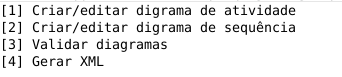

# UML Generator - Grupo 3

|Nome|Matrícula|E-mail|
|--|--|--|
|Elias Bernardo M Magalhães|150009011|ebmm01@gmail.com|
|Leonardo dos Santos Silva Barreiros|150135521|leossb36@gmail.com|
|Lorrany Azevedo|16/0132550|lorrany90@gmail.com|
|Lucas Maciel Aguiar|17/0070735|lucasmacielaguiar@gmail.com|

O projeto tem por objetivo criar uma ferramenta para gerar diagramas de sequência e de atividades em memória, além de persistí-los em arquivos XML.

A aplicação foi desenvolvida em Java, utilizando o JUnit como ferramenta de testes. Recomenda-se utilizar o Eclipse para testar o projeto.

Obs.: Quando o menu solicitar probabilidades (ex.: Transition ou Optional) utilize o formato de ponto flutuante de accordo com a linguagem do seu sistema operacional. Por exemplo, quando o SO está em inglês utilize "." (__ponto__), já se o sistema estiver em português digite o valor com "," (__vírgula__).

> Em inglês: digite "0.5";
> Em português: Ao invés de colocar o valor 0.5, digite "0,5";

## 1. Refatorações

### 1.1 Mover Método ou Mover Atributo

__Objeto de Refatoração:__ Arquivo Menu.java

__Alterações:__

A refatoração foi aplica nos métodos validateDiagrams(), generateXML(), createSequenceDiagramGroup(), createActivityDiagram(), do arquivo Menu.java. Foi criada uma nova classe chamada ValidateDiagrams que suporta todas essas operações relacionadas aos diagramas e não ao menu, também foram movidos os atributos activityDiagram e sequenceDiagramGroup. As operações mantidas no menu são operações referentes a exibição do menu para os usuários.

### 1.2 Extrair Método

__Objeto de Refatoração:__ Classe MenuSequenceDiagram

__Alterações:__

* Migração do arquivo uml.diagrams.MenuSequenceDiagramsGroup.java uml.diagrams.menu.sequencediagram.MenuSequenceDiagramsGroup.java
* Extração da etapa de adicionar elementos no momento da criação ou edição de um diagrama de sequência interno para o menu separado uml.diagrams.menu.sequencediagram.MenuAddItemsSequenceDiagram.java
* Extração de métodos específicos de gerenciamento do agrupador de diagramas de sequência para o controller uml.diagrams.sequence.SequenceDiagramsGroupController

### 1.3 Substituir Método por Objeto-Método

__Objeto de Refatoração:__ Classe ActivityDiagramElements::toString

__Alterações:__

* Criação da classe uml.diagrams.activity.ActivityDiagramElementsToStringGenerator
* Extração da lógica de ActivityDiagramElements::toString para ActivityDiagramElementsToStringGenerator::compute
* Substituição do método ActivityDiagramElements::toString pelo objeto método ActivityDiagramElementsToStringGenerator::compute

### 1.4 Substituir Conditional por Polimorfismo
__Objetivo de Refatoração:__ Classe MenuSequenceDiagramsGroup

__Alterações:__

* Migração do switch case da função uml.diagrams.menu.sequencediagram.menuAddComponentToSequenceDiagramGroup()
* Criação de uma nova função uml.diagrams.menu.sequencediagram.addComponent()
* Substituição do switch case pela função.
